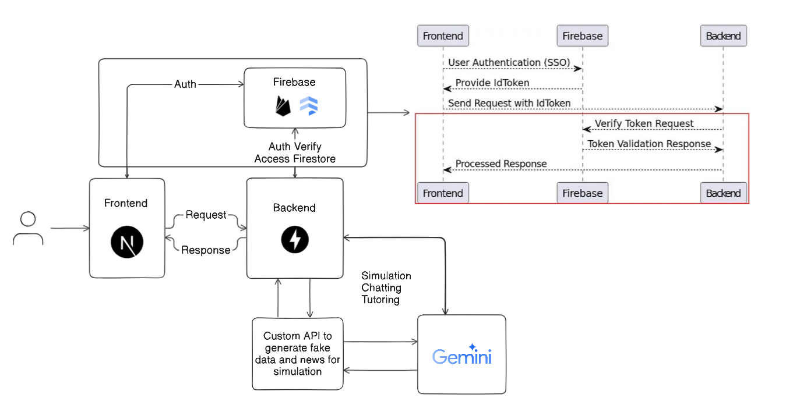
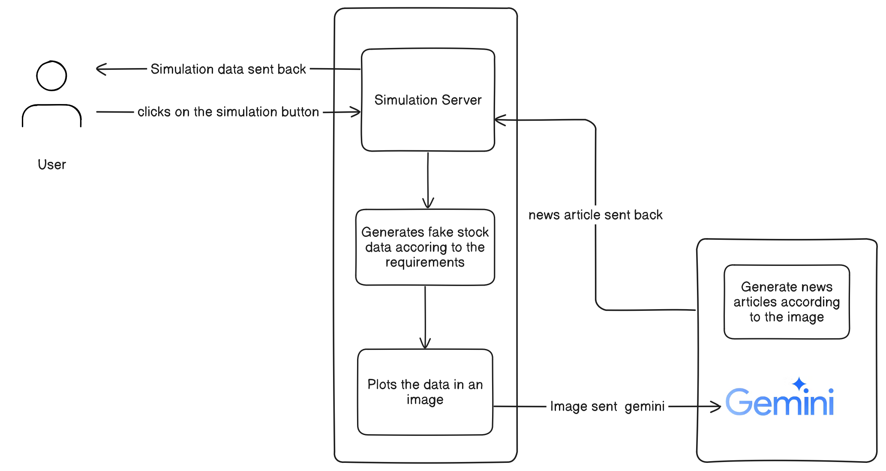
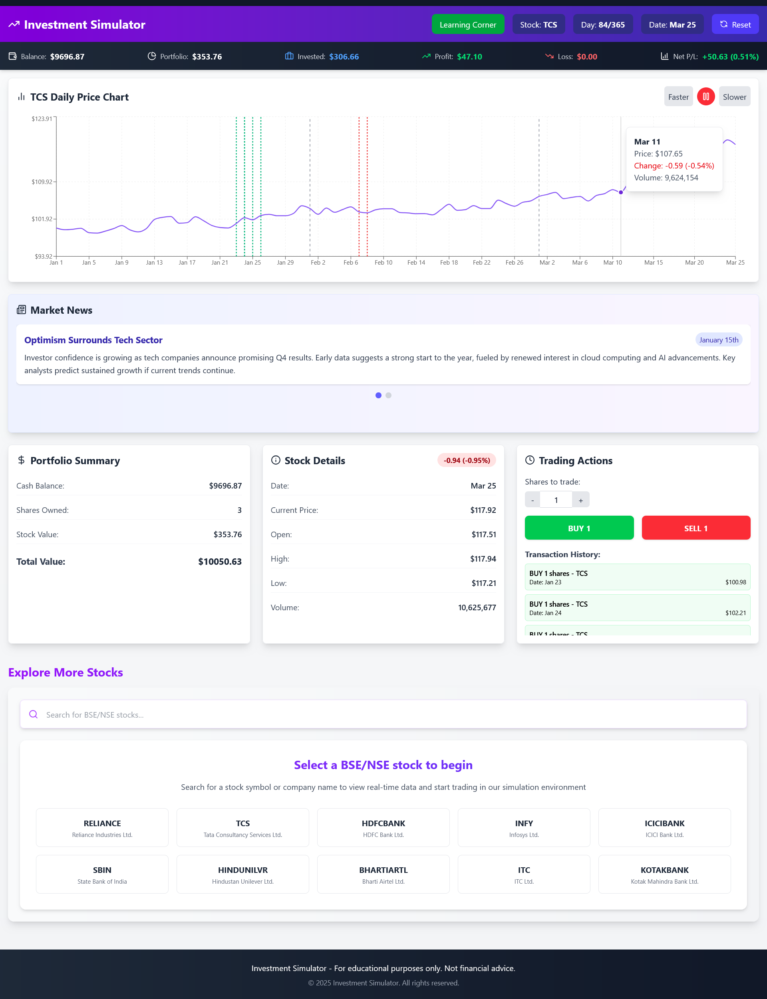
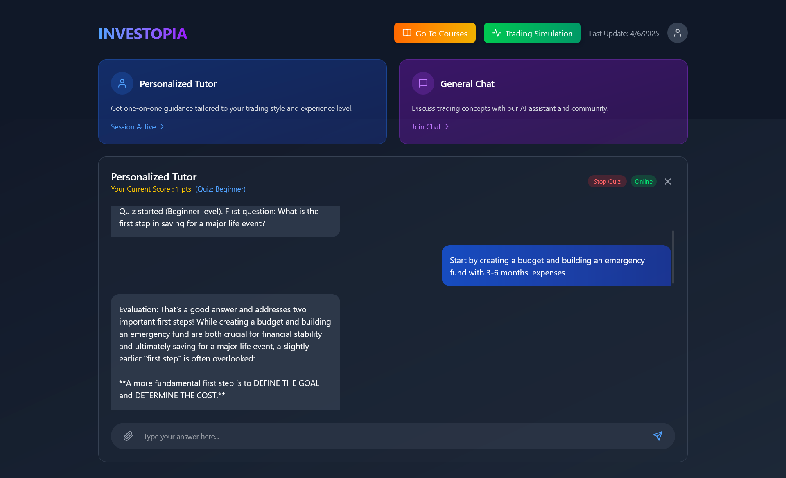

# Project for GDG Solution Challenge 2025

This project is a web application that allows users to simulate trading strategies and learn how to trade. The application is built using FastAPI , NextJS and Gemini API.

## Architecture

## Simulation Workflow

## Screenshots

